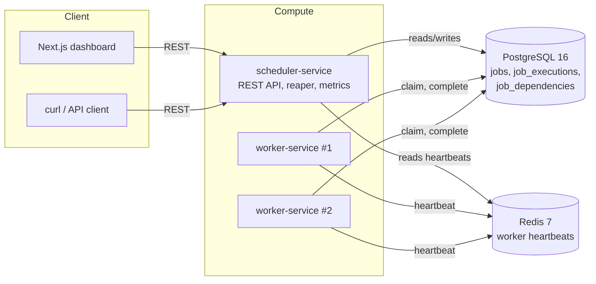
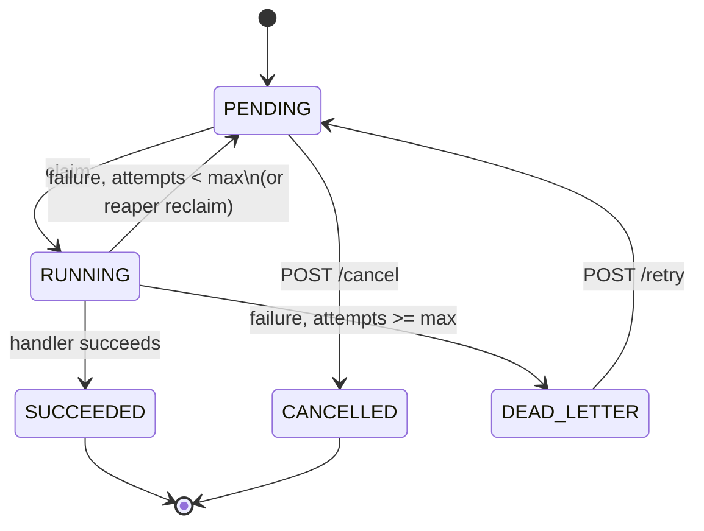

# Distributed Job Scheduler

A fault-tolerant distributed job execution system. Clients submit jobs over REST; a pool of
workers claims and executes them; the system survives worker crashes without losing or
duplicating work. Built by Rishab Nagwani as a portfolio project — the goal was to understand
distributed coordination well enough to defend every design decision under interview questioning,
not just to make something that runs.

Full design rationale lives in [`PROJECT_SPEC.md`](PROJECT_SPEC.md); this README is the tour.

## Architecture



Two backend services, two datastores, one frontend. No message broker, no service mesh, no
Kubernetes — see [Why not Kafka](#why-not-kafka-postgres-as-the-queue) for why that's a deliberate
choice, not an oversight.

| Component | Responsibility |
|---|---|
| `scheduler-service` | REST API, job persistence, dependency DAG validation, orphan reclamation (the reaper), metrics |
| `worker-service` | Claims due jobs, executes handlers, heartbeats, reports results |
| `dashboard` | Job submission, live job/worker state, dependency graph — polls the API, no WebSockets |
| PostgreSQL 16 | Source of truth: jobs, attempts, dependency edges |
| Redis 7 | Worker heartbeat leases only — nothing durable lives here |

## Correctness model

**Delivery guarantee: at-least-once. Not exactly-once — this system never claims that, anywhere.**
A job can execute more than once if a worker completes the side effect and dies before its
`SUCCEEDED` write commits. That's not a bug to fix; it's a property of coordinating a side effect
with a database transaction that can't itself span the two.

**Idempotency is the mitigation, not a workaround.** Every job carries a client-supplied
`idempotencyKey`. Handlers are expected to be idempotent with respect to `(jobId, attempt)` —
`job_executions` records both so duplicate side effects are at least detectable after the fact,
even though the system can't prevent them outright.

### Job state machine



Every transition above and nothing else is legal. This isn't just documentation — a
`BEFORE UPDATE` trigger on `jobs` (`trg_jobs_state_transition`, in
[`V1__initial_schema.sql`](scheduler-service/src/main/resources/db/migration/V1__initial_schema.sql))
rejects any other transition at the database layer, regardless of whether the write comes from the
claim query, the reaper, or a bug. A `CHECK` constraint can't see the previous row's value, which
is why this had to be a trigger and not a constraint.

## The claim query

The heart of the system, in [`JobClaimRepository`](worker-service/src/main/java/com/rishab/scheduler/workers/jobs/JobClaimRepository.java):

```sql
WITH claimed AS (
    SELECT id
    FROM jobs j
    WHERE state = 'PENDING'
      AND next_run_at <= now()
      AND NOT EXISTS (
          SELECT 1 FROM job_dependencies jd
          JOIN jobs dep ON dep.id = jd.depends_on_id
          WHERE jd.job_id = j.id AND dep.state <> 'SUCCEEDED'
      )
    ORDER BY priority DESC, next_run_at ASC
    LIMIT ?
    FOR UPDATE SKIP LOCKED
)
UPDATE jobs j
SET state = 'RUNNING', claimed_by = ?, lease_expires_at = now() + (? * INTERVAL '1 second'),
    attempt_count = attempt_count + 1, updated_at = now()
FROM claimed c
WHERE j.id = c.id
RETURNING j.id, j.job_type, j.payload, j.attempt_count, j.max_attempts, j.priority;
```

**Why `FOR UPDATE SKIP LOCKED` and not plain `FOR UPDATE`.** Without `SKIP LOCKED`, N concurrent
workers serialize on the same candidate rows — the second worker blocks until the first commits,
and throughput collapses to single-worker throughput no matter how many workers you add.
`SKIP LOCKED` lets each worker just take the next row nobody else has locked yet.

**Why the CTE.** `LIMIT` has to apply to the row-locking `SELECT` — which rows get chosen and
locked — not to the `UPDATE`. An `UPDATE ... LIMIT` isn't valid SQL, and re-selecting inside the
`UPDATE`'s `WHERE` clause would reopen exactly the race the locking exists to close.

**Why `READ COMMITTED` (Postgres's default) is correct here, not just left alone.** `SKIP LOCKED`
already does the work a stricter isolation level like `REPEATABLE READ` would otherwise be needed
for: each worker only ever sees and locks rows nobody else has locked, so there's no phantom-read
or lost-update hazard left for a stronger level to close.

**Why this scales to thousands of jobs/minute, not millions.** Every claim still does a
row-locking `SELECT` plus an `UPDATE` against one Postgres primary, and the partial index
(`idx_jobs_claimable`) only bounds the `SELECT` side — not Postgres's per-row lock and WAL
overhead. Past that ceiling the fix isn't a bigger index, it's sharding the queue or moving to a
log-structured broker where "claim" isn't a row lock at all.

**What happens if a worker dies between claim and execution.** `lease_expires_at` is already set.
If the worker never comes back, the reaper (below) notices the lease has expired and no heartbeat
survives it, and returns the job to `PENDING` without incrementing `attempt_count` again — the
attempt was already counted at claim time.

## Lease, heartbeat, and the reaper

Each worker writes `worker:heartbeat:{workerId}` to Redis with a TTL **at process startup** — not
on first claim, which would leave an idle-but-healthy worker invisible to `GET /api/v1/workers`
and the `workers_alive_count` gauge. A scheduled refresh (`HeartbeatService`) rewrites that key
every `ttl / 3` seconds and, in the same cycle, extends `lease_expires_at` for whichever job this
worker is currently executing (`LeaseManager` tracks that one in-flight job id).

`JobReaper` (in `scheduler-service`, not `worker-service` — a dead worker can't reclaim its own
work) sweeps on an interval: for every `RUNNING` job whose lease has expired, if that worker's
heartbeat is gone, the job goes back to `PENDING`. The candidate `SELECT` uses the same
`FOR UPDATE SKIP LOCKED` pattern as the claim query, which is what makes it safe to run the reaper
on multiple `scheduler-service` replicas at once.

### Known races — documented, not hidden

- **A worker can be alive but partitioned from Redis.** Its heartbeat expires, the reaper reclaims
  its job, and another worker picks it up — while the original worker is still executing it. This
  is exactly why handlers must be idempotent; it's not an edge case the system prevents.
- **A worker process can stay alive and heartbeating while the specific thread executing a job
  hangs or dies.** `lease_expires_at` passes, but `redis.exists("worker:heartbeat:" + claimedBy)`
  is still true, so the reaper's guard never fires and the job is stuck `RUNNING` until something
  else intervenes. Heartbeats prove the *process* is alive, not that *that specific job* is making
  progress — there is no per-job liveness signal in this design, only per-worker.

### The scheduler thread-pool trap

Worth knowing because it is invisible to every unit test and only appears under a long-running
job. `JobPoller.pollAndExecute` and `HeartbeatService.refresh` are both `@Scheduled`, and Spring's
**default task-scheduler pool size is 1**. On that default the poller holds the only scheduling
thread for the entire duration of a handler's execution, so the heartbeat refresh cannot run at
all while a job runs — and because that one method writes *both* liveness signals (the Redis key
and the lease extension), a job running longer than `heartbeat-ttl-seconds` makes its own worker
look dead. The reaper then sees both halves of its guard satisfied and requeues the job while the
worker is still executing it; that repeats until `max_attempts` is exhausted, with
`GET /api/v1/workers` reporting zero live workers the whole time.

Observed exactly that against the compose stack: a healthy container at 100% CPU, no heartbeat
key, an empty worker list, and its job bounced back to `PENDING`. The fix is
`spring.task.scheduling.pool.size` in `worker-service`'s `application.yml` — verified by rebuilding
the image and re-running the same 90-second job against the live stack: it completed on attempt 1
with both workers visible throughout. The general lesson: **a lease-extension design is only as
good as the thread that gets to run it.**

## Retry policy: full jitter

```
base   = 2^attempt * baseDelayMillis
capped = min(base, maxDelayMillis)
delay  = random(0, capped)
```

Not fixed backoff, and not exponential-without-jitter. Without jitter, N jobs that fail at the
same instant retry at the same instant, forever — every retry wave hammers the same downstream
dependency in lockstep. Full jitter (picking uniformly across `[0, capped]` each time, rather than
a fixed or narrowly-bounded delay) spreads retries out instead of letting them resonate.
Implemented in [`BackoffPolicy`](worker-service/src/main/java/com/rishab/scheduler/workers/jobs/BackoffPolicy.java), unit-tested in isolation.

## Job dependencies (optional track)

A job can declare `dependsOn: [jobId, ...]` at submission. The claim query's `NOT EXISTS` clause
above enforces it: a job is only claimable once every dependency has reached `SUCCEEDED`.
Submission validates two things before the insert: every referenced id actually exists, and adding
the edges wouldn't create a cycle — checked with a real Kahn's-algorithm topological sort
(`DependencyCycleDetector`), not a shortcut. In practice a cycle can never actually occur through
this API: a new job can only add *outgoing* edges to jobs that already exist, never incoming ones,
so a chain can never loop back to a job that didn't exist yet when the chain was built. The check
runs anyway — it's the guard that would matter the moment any future endpoint let dependencies be
attached to an already-existing job instead of only at creation time.

## Why not Kafka (Postgres as the queue)

The queue is a table, not a broker, and that's a deliberate tradeoff, not a missing feature:

- One fewer moving part to run, monitor, and explain — no ZooKeeper/KRaft, no separate consumer
  group rebalancing story, no second system with its own failure modes to reason about alongside
  Postgres.
- Claim, state transition, and audit trail (`job_executions`) all live in the same transactional
  store, so "did this job actually get claimed" is a single consistent read, not a question that
  spans two systems that can disagree.
- The honest cost: this ceilings out around thousands of jobs/minute on one Postgres primary (see
  the claim query section above), where Kafka would keep scaling. That ceiling is an explicit,
  accepted tradeoff for a system this size — not something the design failed to anticipate.

## Deployment and cost

**Target: ₹0/month, indefinitely** — not a promotional free tier that converts to billing later.
That constraint ruled out the obvious choice, Cloud Run, entirely: Cloud Run allocates CPU only
during request processing and scales to zero, but `worker-service` is a continuous polling loop —
exactly the workload every "free" serverless tier meters hardest. Fixing that
(`--no-cpu-throttling` + `--min-instances=1`) is explicitly a paid configuration. Managed Postgres
(Cloud SQL) and managed Redis (Memorystore) have no free tier at all, and the free tiers of
alternatives like Neon/Upstash burn out in days under continuous polling, not months.

**What actually runs for free:** `scheduler-service`, two `worker-service` replicas, Postgres 16,
and Redis 7 — all on one Oracle Cloud Always Free ARM VM (Ampere A1), running the literal same
`docker-compose.yml` as local dev. Self-hosting Postgres and Redis on that VM sidesteps every
metered limit above, because there's nothing being metered. The dashboard deploys to Vercel's free
tier; CI (build + the full Testcontainers suite) runs on GitHub Actions, which is unlimited on
public repos; images build multi-arch (Temurin publishes `arm64`, so the JVM itself needs no
per-architecture changes) and push to `ghcr.io`, free for public images.

**Status:** the architecture above costs $0 by construction — nothing in it has a paid tier to
fall into. Actual measured numbers (uptime, real request latency under the free-tier VM's CPU
allocation) aren't in this README because the VM itself isn't provisioned yet — that's the one
step in `.github/workflows/ci.yml`'s deploy job that has to happen by hand (Oracle's signup flow
isn't automatable, and Ampere A1 capacity is often unavailable in the first region you try). Fill
this section in with real numbers once it's live.

**Known risk:** Oracle has changed Always Free terms before without much notice (the ARM tier was
halved from 4 OCPU/24 GB to 2 OCPU/12 GB in June 2026). 12 GB is still ample for this stack.
Fallback if Ampere A1 capacity is unobtainable everywhere: GCP's `e2-micro` always-free VM, but at
1 GB RAM both JVMs need `-Xmx256m` and it's tight.

## API

| Method | Path | Notes |
|---|---|---|
| `POST` | `/api/v1/jobs` | Submit. Resubmitting a known `idempotencyKey` returns `200` with the existing job, not a duplicate or an error |
| `GET` | `/api/v1/jobs/{id}` | Full detail: state, payload, attempt history, dependency ids |
| `GET` | `/api/v1/jobs?state=&jobType=&page=&size=` | Paged listing |
| `POST` | `/api/v1/jobs/{id}/cancel` | `PENDING` → `CANCELLED` only; `409` otherwise |
| `POST` | `/api/v1/jobs/{id}/retry` | `DEAD_LETTER` → `PENDING`, resets `attemptCount` to 0; `409` otherwise |
| `GET` | `/api/v1/workers` | Live worker list, from Redis heartbeats |
| `GET` | `/api/v1/stats` | Exact counts by state; latency percentiles deliberately *not* included here — see the endpoint's own response for why |
| `GET` | `/api/v1/job-dependencies` | Every dependency edge, for the dashboard's DAG view |
| `GET` | `/actuator/prometheus` | Micrometer metrics (both services) |

### Ownership guards on completion writes

Every worker write to a claimed job carries `AND claimed_by = ?`, not just `WHERE id = ?`. This is
the counterpart to the reaper: the reaper is allowed to take a job away from a worker it believes
is dead, so a worker can be **wrong about still owning the job it is executing**. Sequence: a
worker's heartbeat lapses (GC pause, Redis blip), the reaper correctly requeues its job, another
worker claims it — and then the first worker's handler returns and writes its outcome. Keyed on id
alone, `rescheduleWithBackoff` would set a job the *new* owner is actively running back to
`PENDING` with `claimed_by = NULL`, making it claimable by a third worker: a duplicate execution
manufactured behind the reaper's back, with no expired lease and no missing heartbeat to explain
it.

The guard turns those writes into no-ops, and the row count comes back to the caller so the lost
race is counted (`jobs_stale_completions_total`) instead of being silent. That counter is the only
signal that distinguishes a *false* reclaim — a live worker wrongly declared dead — from a real
one, since `jobs_reclaimed_total` counts both identically. The attempt is still written to
`job_executions` either way: the work genuinely ran, and the audit trail records what ran, not what
counted. That row is the evidence the job executed twice, which is the at-least-once contract being
honest rather than quiet.

`/api/v1/stats` doesn't aggregate `job_execution_duration` percentiles because that timer is
recorded in `worker-service`'s own in-memory Micrometer registry — a separate JVM `scheduler-service`
has no way to read. A real deployment would scrape both services' `/actuator/prometheus` endpoints
from Prometheus and compute the percentile there; faking the aggregation by re-querying
`job_executions` with `percentile_cont` was explicitly rejected (it scans and degrades as history
grows, where Micrometer is O(1)).

## Running locally

```bash
cp .env.example .env   # set a real POSTGRES_PASSWORD
docker compose up -d
```

This starts Postgres, Redis, `scheduler-service`, and two `worker-service` replicas. Verify:

```bash
curl -s http://localhost:8080/actuator/health
curl -s -X POST http://localhost:8080/api/v1/jobs \
  -H "Content-Type: application/json" \
  -d '{"jobType":"email-simulation","payload":{"sleepMillis":100},"idempotencyKey":"demo-1"}'
```

For the dashboard:

```bash
cd dashboard
cp .env.local.example .env.local
npm install
npm run dev   # http://localhost:3000
```

**Running a service directly with `mvnw spring-boot:run`** (against the same `docker compose up -d
postgres redis`, for iterating on one service without rebuilding its image): `scheduler-service`
binds `8080`, `worker-service` binds `8081`. They need distinct ports specifically so both can run
side by side this way — under `docker compose` each container has its own network namespace and
this never comes up, but two Spring Boot apps on bare Windows/Linux/macOS share one port space, and
both default to 8080 out of the box.

## Testing

Integration tests use Testcontainers against real Postgres and Redis — no mocking the datastore.
**81 tests** across both services (37 in `scheduler-service`, 44 in `worker-service`); run them
with `./mvnw verify` in either module.

All seven fault-injection scenarios from `PROJECT_SPEC.md` §11 are covered:

| §11 scenario | Test |
|---|---|
| 1. Concurrent claim — 10 threads, 100 jobs, exactly once | `ConcurrentClaimIntegrationTest` |
| 2. Worker crash mid-execution → reaper reclaims → another worker completes | `WorkerCrashRecoveryIntegrationTest` |
| 3. Idempotency — same key twice, one row | `JobSubmissionAcidIntegrationTest`, `JobApiIntegrationTest` |
| 4. Retry exhaustion — exactly `maxAttempts` executions then `DEAD_LETTER` | `RetryExhaustionIntegrationTest` |
| 5. Backoff timing — `next_run_at` within jitter bounds | `RetryExhaustionIntegrationTest`, `BackoffPolicyTest` |
| 6. Lease extension — long job not reclaimed while heartbeating | `LeaseExtensionIntegrationTest` |
| 7. Reaper idempotency — concurrent reapers don't double-requeue | `ReaperConcurrencyIntegrationTest` |

Two of these make a substitution worth naming rather than burying, because each is a place the
test is *modelling* the failure instead of causing it:

- **The "crash" in scenario 2 is a deleted heartbeat key plus a lapsed lease**, not a
  `docker kill`. That is precisely what a killed container looks like to the reaper — the heartbeat
  key and the lease are the only two signals it reads — but it does not prove the JVM gets no
  chance to clean up after itself. Nothing in the reclaim path depends on that: there is
  deliberately no shutdown hook releasing a claim, because a worker healthy enough to run one was
  never the failure worth protecting against.
- **"Two scheduler instances" in scenario 7 is two threads against one `JobReaper` bean**, not two
  processes. The reaper holds no per-instance state at all; its entire safety argument is
  `FOR UPDATE SKIP LOCKED` plus one transaction per invocation, both of which are per-connection.
  Threads and processes contend identically at the Postgres level.

Beyond §11, `JobSubmissionAcidIntegrationTest` covers the transactional properties the submission
path rests on: concurrent submitters of one `idempotencyKey` producing exactly one row (uniqueness
enforced by the database, not by a check-then-insert window), a failed insert leaving no orphaned
`job_dependencies` edges, and a committed job being visible on a connection other than the one that
wrote it.

Still done by hand, not in CI: the `docker compose` load test from §13 — 1000 jobs across three
workers, and physically killing a worker container mid-run to watch the reaper recover it.

## Outbound request safety (SSRF)

The `http-callback` handler takes its destination from job payload, and the submission API has no
authentication. Untreated, that combination is an unauthenticated request-forgery primitive
pointed at everything the VM can reach: Postgres, Redis, the other compose containers, and — the
real prize on any cloud VM — the instance metadata service at `169.254.169.254`, which hands out
credentials to any plain HTTP request originating on the box.

`CallbackUrlValidator` applies a deny-by-default egress policy, configured under
`worker.http-callback`:

| Control | Default |
|---|---|
| Scheme allow-list | `http`, `https` — blocks `file:`, `gopher:`, `jar:`, which turn an SSRF into a file read |
| Resolved-address check | Refuses loopback, link-local (metadata), RFC1918, CGNAT, IPv6 unique-local, multicast, wildcard |
| Redirect following | Disabled |
| Port allow-list | Empty (any); narrow to `[80, 443]` to block internal port scanning |
| Host allow-list | Empty (any passing the IP checks) |

Two decisions worth defending:

**Validation is on the resolved IP, not the URL string.** `localhost` is one spelling of many:
`127.0.0.1`, `127.1`, `2130706433`, `0x7f000001`, `[::1]`, `0.0.0.0`, and any attacker-controlled
DNS name with an A record pointing home all reach the same place. Resolving the name and inspecting
the `InetAddress` collapses every spelling into one check. Verified live against the deployed stack
by firing each of those spellings, plus the compose network's own `postgres`/`redis` hostnames and
the metadata address, at a real `http-callback` job — every one was dead-lettered with the specific
resolved address and reason in its error message. All resolved addresses are checked, not just the
first, so a host with both a public and a private A record cannot slip through.

**Redirects are refused, not followed.** Validation applies to the URL the client supplied; a
followed redirect is a second request to an address that was never validated. Passing validation
and then answering `302 Location: http://169.254.169.254/` is the standard way to walk an SSRF
filter, so the request factory refuses to follow and a 3xx is reported as a job failure.

**The gap this does not close: DNS rebinding.** The name is validated, then the HTTP client
resolves it again to connect. Whoever controls that name's authoritative DNS can answer the first
lookup publicly and the second with `169.254.169.254`. Closing it properly needs connection-level
address pinning, which is easy to get subtly wrong for TLS. The honest production answer is
network-level egress control — nftables/iptables rules on the VM denying the worker containers
`169.254.0.0/16` and the compose subnet — with this validator as the defence-in-depth layer that
also produces a legible error. The `allowed-hosts` list is the in-app mitigation that *is* immune
to rebinding, since it is evaluated on the name.

`allow-private-networks` must stay `false` wherever the API is publicly reachable. It exists so
local development and the handler's own tests can call back to localhost.

## What this system doesn't claim

- **Not exactly-once delivery**, anywhere — see [Correctness model](#correctness-model).
- **No authentication.** Spring Security is explicitly out of scope; anyone who can reach the API
  can submit, cancel, or retry jobs. Fine for a portfolio demo, not fine to expose as-is. Because
  of this, the one handler that dials a client-supplied address is locked down — see below.
- **No message broker.** See [Why not Kafka](#why-not-kafka-postgres-as-the-queue).
- **Not built for millions of jobs/minute.** See the claim query section's scaling ceiling.
